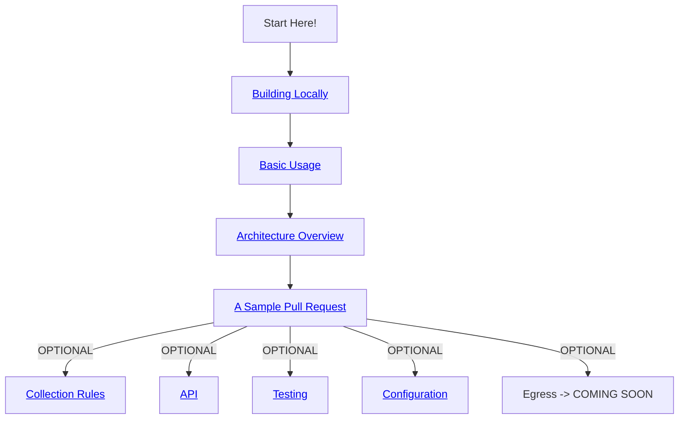

# Overview

Our learning path is designed to help you get up-and-running with your first contribution to `dotnet-monitor` through a hands-on explanation of the inner workings of the tool. We recommend that new contributors begin by following the main learning path, and then optionally pursue branches that are relevant to the parts of the tool you want to work on. If you find any pages that are out of date, let us know by clicking the `Was This Helpful` button at the top of the page, and we'll update the page as soon as possible.

## Main Learning Path

*Note*: Need to update links to point to dotnet-monitor repo, not my branch
