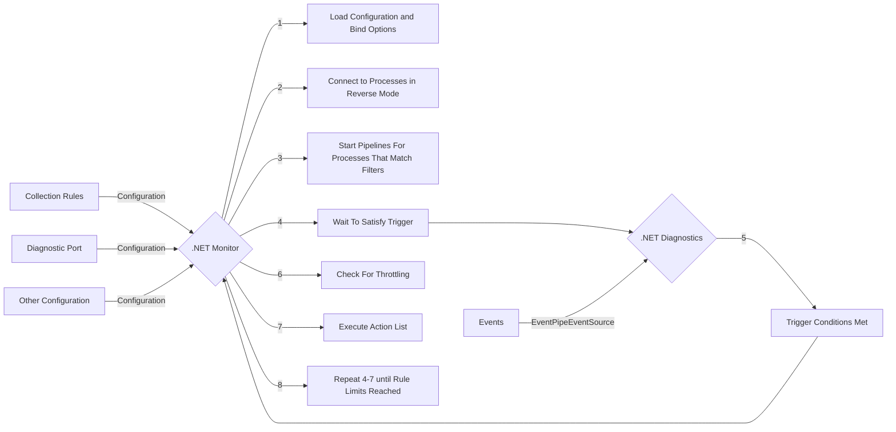

### Was this documentation helpful? [Share feedback](https://www.research.net/r/DGDQWXH?src=documentation%2FlearningPath%2Fcollectionrules)

# Collection Rules

## How Collection Rules Work (As A User)

You can learn more about how collection rules work [here](https://github.com/dotnet/dotnet-monitor/blob/main/documentation/collectionrules/collectionrules.md#collection-rules), with usage examples [here](https://github.com/dotnet/dotnet-monitor/blob/main/documentation/collectionrules/collectionruleexamples.md). If you're unfamiliar with collection rules in `dotnet monitor`, we recommend taking a look at how to use collection rules before continuing with this learning path.

## Collection Rule Architecture

### Collection Rules Flow

The implementation of collection rules is distributed between the `dotnet monitor` repo and the [`dotnet diagnostics` repo](https://github.com/dotnet/diagnostics). The flowchart below shows a simplified version of how `dotnet monitor` and `dotnet diagnostics` interact to run collection rules.

### Key Areas Of The Code

* Registration for collection rules can be found [here](https://github.com/dotnet/dotnet-monitor/blob/ac10d93babcc5388a3c19d19e6c58258c2e21eb8/src/Tools/dotnet-monitor/ServiceCollectionExtensions.cs#L100). When adding a new trigger or action, these types need to be registered here. This section is also responsible for making sure options get configured and validated.
* Options for collection rules can be found [here](https://github.com/dotnet/dotnet-monitor/blob/ac10d93babcc5388a3c19d19e6c58258c2e21eb8/src/Tools/dotnet-monitor/CollectionRules/Options/CollectionRuleOptions.cs).
* Rules are applied, removed, restarted, and monitored for the `/collectionrules` API Endpoint [here](https://github.com/dotnet/dotnet-monitor/blob/ac10d93babcc5388a3c19d19e6c58258c2e21eb8/src/Tools/dotnet-monitor/CollectionRules/CollectionRuleService.cs).
* The pipeline responsible for the lifetime of a single collection rule running against a single process can be found [here](https://github.com/dotnet/dotnet-monitor/blob/ac10d93babcc5388a3c19d19e6c58258c2e21eb8/src/Tools/dotnet-monitor/CollectionRules/CollectionRulePipeline.cs#L54).
* To run collection rules, `dotnet monitor` must be in `Listen` mode - this is set via [DiagnosticPortOptions](https://github.com/dotnet/dotnet-monitor/blob/ac10d93babcc5388a3c19d19e6c58258c2e21eb8/src/Microsoft.Diagnostics.Monitoring.Options/DiagnosticPortOptions.cs).
* For each type of trigger, [this](https://github.com/dotnet/diagnostics/blob/f66f2a9d70fba32b1639cd3bd2702866128c1031/src/Microsoft.Diagnostics.Monitoring.EventPipe/Triggers/ITraceEventTrigger.cs#L29) is responsible for determining whether the triggering conditions have been satisfied.

### Triggers

A trigger will monitor for a specific condition in the target application and raise a notification when that condition has been observed. Options for triggers can be found [here](https://github.com/dotnet/dotnet-monitor/blob/ac10d93babcc5388a3c19d19e6c58258c2e21eb8/src/Tools/dotnet-monitor/CollectionRules/Options/CollectionRuleTriggerOptions.cs).

All individual trigger factories all end up here - this creates the pipeline on the .NET Diagnostics side:
https://github.com/dotnet/dotnet-monitor/blob/ac10d93babcc5388a3c19d19e6c58258c2e21eb8/src/Tools/dotnet-monitor/CollectionRules/Triggers/EventPipeTriggerFactory.cs
This is where the trigger factory is called: https://github.com/dotnet/dotnet-monitor/blob/ac10d93babcc5388a3c19d19e6c58258c2e21eb8/src/Tools/dotnet-monitor/CollectionRules/CollectionRulePipeline.cs#L99

When events are received, this checks to see if the condition has been satisfied
https://github.com/dotnet/diagnostics/blob/f66f2a9d70fba32b1639cd3bd2702866128c1031/src/Microsoft.Diagnostics.Monitoring.EventPipe/Triggers/Pipelines/TraceEventTriggerPipeline.cs#L107

### Actions

Actions allow executing an operation or an external executable in response to a trigger condition being satisfied. Options for actions can be found [here](https://github.com/dotnet/dotnet-monitor/blob/ac10d93babcc5388a3c19d19e6c58258c2e21eb8/src/Tools/dotnet-monitor/CollectionRules/Options/CollectionRuleActionOptions.cs); the type of `Settings` is determined by which action is being used (possible action types can be found [here](https://github.com/dotnet/dotnet-monitor/tree/ac10d93babcc5388a3c19d19e6c58258c2e21eb8/src/Tools/dotnet-monitor/CollectionRules/Options/Actions)). The interface for all actions can be found [here](https://github.com/dotnet/dotnet-monitor/blob/ac10d93babcc5388a3c19d19e6c58258c2e21eb8/src/Tools/dotnet-monitor/CollectionRules/Actions/ICollectionRuleAction.cs) - this allows `dotnet monitor` to start an action, wait for it to complete, and get its output values regardless of the action's behavior. The action list is [executed](https://github.com/dotnet/dotnet-monitor/blob/ac10d93babcc5388a3c19d19e6c58258c2e21eb8/src/Tools/dotnet-monitor/CollectionRules/CollectionRulePipeline.cs#L142) once the triggering condition has been met (assuming the action list isn't [throttled](#Limits)), with each action by default starting without waiting for prior actions to complete.

### Filters

Filters can optionally be applied to a collection rule to choose which processes can trigger the rule. This uses the same set of [options](https://github.com/dotnet/dotnet-monitor/blob/ac10d93babcc5388a3c19d19e6c58258c2e21eb8/src/Microsoft.Diagnostics.Monitoring.Options/ProcessFilterOptions.cs#L47) as setting the default process for `dotnet-monitor`. When starting a collection rule, [these filters are used to check if the current process should have the collection rule applied to it](https://github.com/dotnet/dotnet-monitor/blob/ac10d93babcc5388a3c19d19e6c58258c2e21eb8/src/Tools/dotnet-monitor/CollectionRules/CollectionRuleContainer.cs#L188); if so, the collection rule starts. Filters can also be populated by [Templates](#templates).

### Limits

Limits can optionally be applied to a collection rule to constrain the lifetime of the rule and how often its actions can be run before being throttled. Options for limits can be found [here](https://github.com/dotnet/dotnet-monitor/blob/ac10d93babcc5388a3c19d19e6c58258c2e21eb8/src/Tools/dotnet-monitor/CollectionRules/Options/CollectionRuleLimitsOptions.cs). When provided (or when using default values), limits are applied in the collection rule pipline while running. `RuleDuration` is used to [create a token](https://github.com/dotnet/dotnet-monitor/blob/ac10d93babcc5388a3c19d19e6c58258c2e21eb8/src/Tools/dotnet-monitor/CollectionRules/CollectionRulePipeline.cs#L79) that shuts down the pipeline. `ActionCountSlidingWindowDuration` does not rely on setting cancellation tokens; rather, the number of executions within the sliding window are checked on-demand [here](https://github.com/dotnet/dotnet-monitor/blob/ac10d93babcc5388a3c19d19e6c58258c2e21eb8/src/Microsoft.Diagnostics.Monitoring.WebApi/CollectionRulePipelineState.cs#L211), and `ActionCount` is referenced to determine whether the rule needs to [terminate](https://github.com/dotnet/dotnet-monitor/blob/ac10d93babcc5388a3c19d19e6c58258c2e21eb8/src/Microsoft.Diagnostics.Monitoring.WebApi/CollectionRulePipelineState.cs#L194) or [throttle](https://github.com/dotnet/dotnet-monitor/blob/ac10d93babcc5388a3c19d19e6c58258c2e21eb8/src/Microsoft.Diagnostics.Monitoring.WebApi/CollectionRulePipelineState.cs#L234). The individual properties for limits can be optionally set as [defaults](#collection-rule-defaults); limits can also be set using [Templates](#templates).

## Miscellaneous

### Trigger Shortcuts

Trigger Shortcuts provide improved defaults, range validation, and a simpler syntax for [several commonly used `EventCounter` triggers](https://github.com/dotnet/dotnet-monitor/tree/ac10d93babcc5388a3c19d19e6c58258c2e21eb8/src/Tools/dotnet-monitor/CollectionRules/Options/Triggers/EventCounterShortcuts). These shortcuts provide the same functionality as using the standard `EventCounter` syntax, but have fewer available options (since there is no need to specify the `ProviderName` or the `CounterName`) - as a result, shortcuts do not inherit from `EventCounterOptions`, but rather [IEventCounterShortcuts](https://github.com/dotnet/dotnet-monitor/blob/ac10d93babcc5388a3c19d19e6c58258c2e21eb8/src/Tools/dotnet-monitor/CollectionRules/Options/Triggers/EventCounterShortcuts/IEventCounterShortcuts.cs). Each type of shortcut is registered independently [here](https://github.com/dotnet/dotnet-monitor/blob/ac10d93babcc5388a3c19d19e6c58258c2e21eb8/src/Tools/dotnet-monitor/ServiceCollectionExtensions.cs#L117). After binding with configuration and undergoing validation, shortcuts are then converted to be treated as `EventCounter` triggers [here](https://github.com/dotnet/dotnet-monitor/blob/ac10d93babcc5388a3c19d19e6c58258c2e21eb8/src/Tools/dotnet-monitor/CollectionRules/Triggers/EventCounterTriggerFactory.cs), using their respective defaults instead of the generic ones.

### Templates

Templates allow users to design reusable collection rule components by associating a referencable name with a piece of configuration. Options for templates can be found [here](https://github.com/dotnet/dotnet-monitor/blob/ac10d93babcc5388a3c19d19e6c58258c2e21eb8/src/Tools/dotnet-monitor/CollectionRules/Options/TemplateOptions.cs). Before collection rules undergo validation, `dotnet monitor` checks to see if any of the components of the rule in configuration [list the name of a template](https://github.com/dotnet/dotnet-monitor/blob/ac10d93babcc5388a3c19d19e6c58258c2e21eb8/src/Tools/dotnet-monitor/CollectionRules/Configuration/CollectionRulePostConfigureNamedOptions.cs) - if so, the collection rule's options are populated from the correspondingly named template. Note that templates undergo the same binding process for triggers/actions as standard collection rules; however, since templates are treated as separate parts of configuration, this binding instead happens [here](https://github.com/dotnet/dotnet-monitor/blob/ac10d93babcc5388a3c19d19e6c58258c2e21eb8/src/Tools/dotnet-monitor/CollectionRules/Configuration/TemplatesConfigureNamedOptions.cs).

### Collection Rule Defaults

Defaults can be used to limit the verbosity of configuration, allowing frequently used values for collection rules to be assigned as defaults. Options for collection rule defaults can be found [here](https://github.com/dotnet/dotnet-monitor/blob/ac10d93babcc5388a3c19d19e6c58258c2e21eb8/src/Tools/dotnet-monitor/CollectionRules/Options/CollectionRuleDefaultsOptions.cs). These defaults are merged with the user's provided configuration [here](https://github.com/dotnet/dotnet-monitor/blob/ac10d93babcc5388a3c19d19e6c58258c2e21eb8/src/Tools/dotnet-monitor/CollectionRules/Options/DefaultCollectionRulePostConfigureOptions.cs) - any properties that the user hasn't set (that have corresponding default values) will be updated at this point to use the default values. This step occurs prior to `dotnet monitor` attempting to use its built-in defaults, which allows user defaults to take precedence.

### Collection Rule API Endpoint

The Collection Rule API Endpoint allows users to get information about the state of their collection rules, providing general information [here](https://github.com/dotnet/dotnet-monitor/blob/ac10d93babcc5388a3c19d19e6c58258c2e21eb8/src/Microsoft.Diagnostics.Monitoring.WebApi/Controllers/DiagController.cs#L546) and more specific information about a particular rule [here](https://github.com/dotnet/dotnet-monitor/blob/ac10d93babcc5388a3c19d19e6c58258c2e21eb8/src/Microsoft.Diagnostics.Monitoring.WebApi/Controllers/DiagController.cs#L571). **This API is solely for viewing the current state of rules, not altering state**.

Each [collection rule pipeline](https://github.com/dotnet/dotnet-monitor/blob/ac10d93babcc5388a3c19d19e6c58258c2e21eb8/src/Tools/dotnet-monitor/CollectionRules/CollectionRulePipeline.cs) has a [state holder](https://github.com/dotnet/dotnet-monitor/blob/ac10d93babcc5388a3c19d19e6c58258c2e21eb8/src/Microsoft.Diagnostics.Monitoring.WebApi/CollectionRulePipelineState.cs) that keeps track of the rule's execution. By keeping track of the pipeline's state in real-time, this state doesn't need to be calculated in response to the `/collectionrules` endpoint. However, other user-facing information, such as countdowns, are calculated on-demand - these values are solely for display purposes and not used by `dotnet-monitor` when determining when to change state (see [Limits](#limits) for more information).

## Keeping Documentation Up-To-Date

When making changes to collection rules that require updates to configuration, these changes should be added [here](https://github.com/dotnet/dotnet-monitor/blob/ac10d93babcc5388a3c19d19e6c58258c2e21eb8/documentation/configuration.md#collection-rule-configuration). Additional information on collection rules and examples can be provided [here](https://github.com/dotnet/dotnet-monitor/tree/ac10d93babcc5388a3c19d19e6c58258c2e21eb8/documentation/collectionrules).
