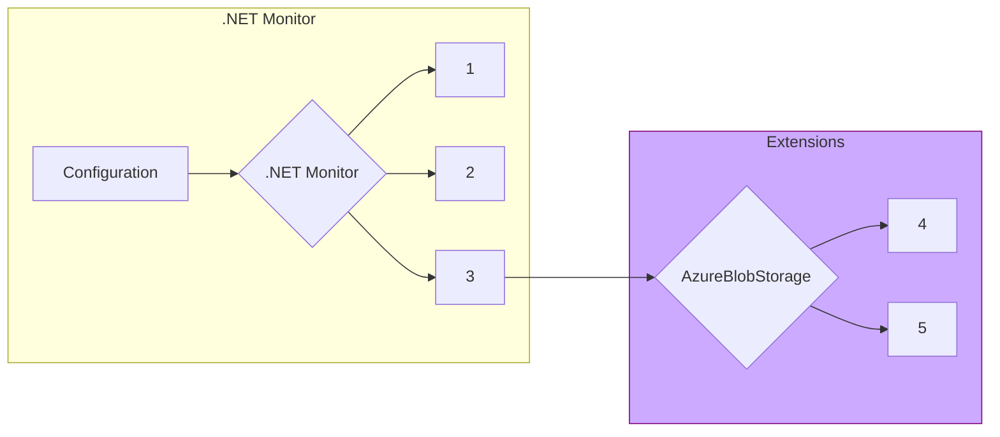

### Was this documentation helpful? [Share feedback](https://www.research.net/r/DGDQWXH?src=documentation%2FlearningPath%2Fegress)

# Egress

`dotnet monitor` includes functionality to egress (send) artifacts to permanent storage locations, such as `Azure Blob Storage`. For v8, `dotnet monitor` has converted to an extensible egress model that allows developers to author their own egress providers that aren't included in the default `dotnet monitor` product. This section covers how the egress extensibility model works, and provides information about how to develop an egress extension (using the `AzureBlobStorage` egress provider as an example). 

## How Egress Works

1. [User initiates collection of artifact with a designated egress provider](https://github.com/dotnet/dotnet-monitor/blob/289105261537f3977f7d1886f936d19bb3639d46/src/Microsoft.Diagnostics.Monitoring.WebApi/Operation/EgressOperation.cs#L49)
1. [Locate extension's executable and manifest](https://github.com/dotnet/dotnet-monitor/blob/289105261537f3977f7d1886f936d19bb3639d46/src/Tools/dotnet-monitor/Extensibility/ExtensionDiscoverer.cs#L28)
1. [Start extension and pass configuration/artifact via StdIn to the other process](https://github.com/dotnet/dotnet-monitor/blob/289105261537f3977f7d1886f936d19bb3639d46/src/Tools/dotnet-monitor/Egress/Extension/EgressExtension.cs#L102)
1. Connect to egress provider using configuration and send artifact
1. Provide success/failure information via StdOut to dotnet-monitor

## Distribution and Acquisition Model

### Dotnet-Monitor Versions

### Well Known Egress Provider Locations

### Manually Acquiring An Egress Provider 

## Building An Egress Provider

### Extension Manifest

All extensions must include a manifest titled `extension.json` that provides `dotnet-monitor` with some basic information about the extension.

| Name | Required | Type | Description |
|---|---|---|---|
| `Name` | true | string | The name of the extension (e.g. AzureBlobStorage) that users will use when writing configuration for the egress provider. |
| `ExecutableFileName` | false | string | If specified, the executable file (without extension) to be launched when executing the extension; either `AssemblyFileName` or `ExecutableFileName` must be specified. |
| `AssemblyFileName` | false | string | If specified, executes the extension using the shared .NET host (e.g. dotnet.exe) with the specified entry point assembly (without extension); either `AssemblyFileName` or `ExecutableFileName` must be specified. |
| `Modes` | false | [[ExtensionMode](NEED THIS)] | Additional modes the extension can be configured to run in. |

### Configuration

Extensions are designed to receive all user configuration through `dotnet monitor` - the extension itself should not rely on any additional configuration sources. [`dotnet monitor` will pass serialized configuration via `StdIn` to the extension](https://github.com/dotnet/dotnet-monitor/blob/289105261537f3977f7d1886f936d19bb3639d46/src/Tools/dotnet-monitor/Egress/Extension/EgressExtension.cs#L182); an example of how the `AzureBlobStorage` egress provider interprets the egress payload can be found [here](https://github.com/dotnet/dotnet-monitor/blob/289105261537f3977f7d1886f936d19bb3639d46/src/Microsoft.Diagnostics.Monitoring.Extension.Common/EgressHelper.cs#L139).

In addition to the configuration provided specifically for your egress provider, `dotnet-monitor` also includes the values stored in [`Properties`](https://github.com/dotnet/dotnet-monitor/blob/289105261537f3977f7d1886f936d19bb3639d46/src/Microsoft.Diagnostics.Monitoring.Options/EgressOptions.cs#L21). Note that `Properties` may include information that is not relevant to the current egress provider, since it is a shared bucket between all configured egress providers.

### Communicating With Dotnet-Monitor

## Keeping Documentation Up-To-Date

