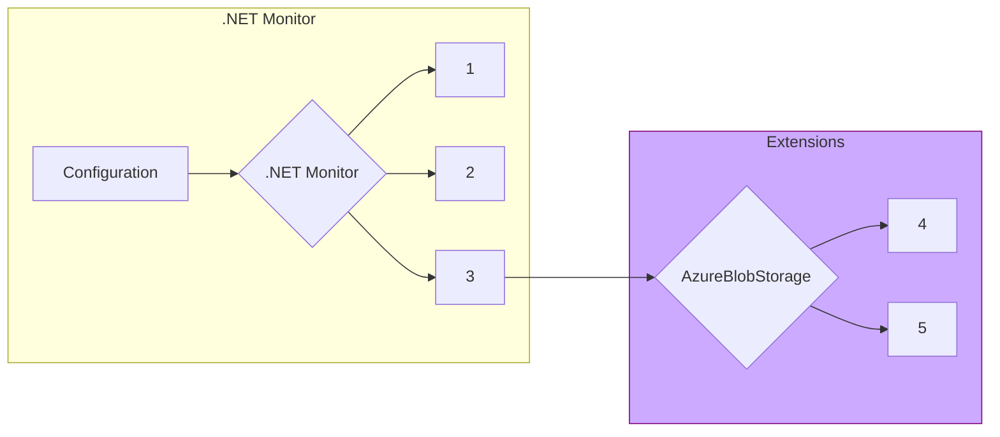

### Was this documentation helpful? [Share feedback](https://www.research.net/r/DGDQWXH?src=documentation%2FlearningPath%2Fegress)

# Egress

`dotnet monitor` includes functionality to egress (send) artifacts to permanent storage locations, such as `Azure Blob Storage`. For v8, `dotnet monitor` has converted to an extensible egress model that allows developers to author their own egress providers that aren't included in the default `dotnet monitor` product. This section covers how the egress extensibility model works, and provides information about how to develop an egress extension (using the `AzureBlobStorage` egress provider as an example). 

## How Egress Works

1. [User initiates collection of artifact with a designated egress provider](https://github.com/dotnet/dotnet-monitor/blob/289105261537f3977f7d1886f936d19bb3639d46/src/Microsoft.Diagnostics.Monitoring.WebApi/Operation/EgressOperation.cs#L49)
1. Locate extension's executable and manifest 
1. [Start extension and pass configuration/artifact via StdIn to the other process](https://github.com/dotnet/dotnet-monitor/blob/289105261537f3977f7d1886f936d19bb3639d46/src/Tools/dotnet-monitor/Egress/Extension/EgressExtension.cs#L102)
1. Connect to egress provider using configuration and send artifact
1. Provide success/failure information via StdOut to dotnet-monitor

## Distribution and Acquisition Model

## Building An Egress Provider

### Extension Manifest

### Configuration

### Communicating With Dotnet-Monitor

## Keeping Documentation Up-To-Date

