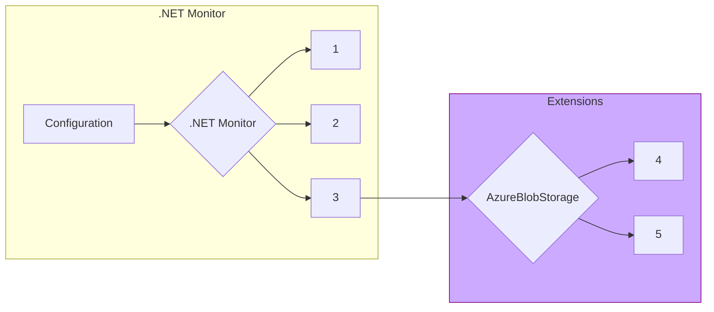

# Egress

`dotnet monitor` includes functionality to egress (send) artifacts to permanent storage locations, such as `Azure Blob Storage`. For .NET Monitor 8, the tool has converted to using an extensible egress model that allows developers to author their own egress providers that aren't built into the `dotnet monitor` product. This section covers how the egress extensibility model works, and provides information about how to develop an egress extension (using the `AzureBlobStorage` egress provider as an example).

## How Egress Works

1. [User initiates collection of artifact with a designated egress provider](https://github.com/dotnet/dotnet-monitor/blob/b5bf953026d47318e521e5580524866ef0aab764/src/Microsoft.Diagnostics.Monitoring.WebApi/Operation/EgressOperation.cs#L45)
1. [Locate extension's executable and manifest](https://github.com/dotnet/dotnet-monitor/blob/b5bf953026d47318e521e5580524866ef0aab764/src/Tools/dotnet-monitor/Extensibility/ExtensionDiscoverer.cs#L28)
1. [Start extension and pass configuration/artifact via StdIn to the other process](https://github.com/dotnet/dotnet-monitor/blob/b5bf953026d47318e521e5580524866ef0aab764/src/Tools/dotnet-monitor/Egress/Extension/EgressExtension.cs#L102)
1. [Connect to egress provider using configuration and send artifact](https://github.com/dotnet/dotnet-monitor/blob/b5bf953026d47318e521e5580524866ef0aab764/src/Extensions/AzureBlobStorage/AzureBlobEgressProvider.cs#L36)
1. [Provide success/failure information via StdOut to dotnet-monitor](https://github.com/dotnet/dotnet-monitor/blob/b5bf953026d47318e521e5580524866ef0aab764/src/Microsoft.Diagnostics.Monitoring.Extension.Common/EgressHelper.cs#L77)

## Distribution and Acquisition Model

### Dotnet-Monitor Versions

There are two versions of the `dotnet-monitor` image being offered: `monitor` and `monitor-base`. The default version of `dotnet-monitor` includes every supported egress provider (to avoid breaking changes, this uses the existing `monitor` naming); the `monitor-base` version is a newly created image for .NET Monitor 8+ and only includes the `FileSystem` egress provider, allowing users to manually include their preferred egress providers. Note that there is currently only one version of the .NET Core global tool, which includes every supported egress provider for convenience.

### Well Known Egress Provider Locations

There are 3 [locations](https://github.com/dotnet/dotnet-monitor/blob/b5bf953026d47318e521e5580524866ef0aab764/src/Tools/dotnet-monitor/ServiceCollectionExtensions.cs#L279) that `dotnet-monitor` scans when looking for the extensions directory (the highest priority location is listed first):
- Next to the executing `dotnet-monitor` assembly
- SharedConfigDirectory
  - On Windows, `%ProgramData%\dotnet-monitor`
  - On *nix, `/etc/dotnet-monitor`
- UserConfigDirectory
  - On Windows, `%USERPROFILE%\.dotnet-monitor\settings.json`
  - On *nix,`$XDG_CONFIG_HOME/dotnet-monitor/settings.json`
  - If `$XDG_CONFIG_HOME` isn't defined, we fall back to `$HOME/.config/dotnet-monitor/settings.json`
### Manually Acquiring An Egress Provider
#### TODO

The distribution/acquisition model for third-party egress providers is determined by the author of the extension.

## Building An Egress Provider

### Extension Manifest

All extensions must include a manifest titled [`extension.json`](https://github.com/dotnet/dotnet-monitor/blob/b5bf953026d47318e521e5580524866ef0aab764/src/Extensions/AzureBlobStorage/extension.json) that provides `dotnet-monitor` with some basic information about the extension.

| Name | Required | Type | Description |
|---|---|---|---|
| `Name` | true | string | The name of the extension (e.g. AzureBlobStorage) that users will use when writing configuration for the egress provider. |
| `ExecutableFileName` | false | string | If specified, the executable file (without extension) to be launched when executing the extension; either `AssemblyFileName` or `ExecutableFileName` must be specified. |
| `AssemblyFileName` | false | string | If specified, executes the extension using the shared .NET host (e.g. dotnet.exe) with the specified entry point assembly (without extension); either `AssemblyFileName` or `ExecutableFileName` must be specified. |
| `Modes` | false | [[ExtensionMode](../api/definitions.md#extensionmode)] | Additional modes the extension can be configured to run in (see an example of Validation [here](https://github.com/dotnet/dotnet-monitor/blob/b5bf953026d47318e521e5580524866ef0aab764/src/Microsoft.Diagnostics.Monitoring.Extension.Common/EgressHelper.cs#L80)). |

### Configuration

Extensions are designed to receive all user configuration through `dotnet monitor` - the extension itself should not rely on any additional configuration sources.

In addition to the configuration provided specifically for your egress provider, `dotnet-monitor` also includes the values stored in [`Properties`](https://github.com/dotnet/dotnet-monitor/blob/b5bf953026d47318e521e5580524866ef0aab764/src/Microsoft.Diagnostics.Monitoring.Options/EgressOptions.cs#L21). Note that `Properties` may include information that is not relevant to the current egress provider, since it is a shared bucket between all configured egress providers.

### Communicating With Dotnet-Monitor

[`dotnet monitor` will pass serialized configuration via `StdIn` to the extension](https://github.com/dotnet/dotnet-monitor/blob/b5bf953026d47318e521e5580524866ef0aab764/src/Tools/dotnet-monitor/Egress/Extension/EgressExtension.cs#L182); an example of how the `AzureBlobStorage` egress provider interprets the egress payload can be found [here](https://github.com/dotnet/dotnet-monitor/blob/b5bf953026d47318e521e5580524866ef0aab764/src/Microsoft.Diagnostics.Monitoring.Extension.Common/EgressHelper.cs#L141). **It's important to validate the version number at the beginning of the stream; if an extension does not have the same version as `dotnet-monitor`, it should not attempt to continue reading from the stream, and users may need to update to a newer version of the extension.**

All output from the extension will be passed back to `dotnet-monitor`; this is logged [here](https://github.com/dotnet/dotnet-monitor/blob/b5bf953026d47318e521e5580524866ef0aab764/src/Tools/dotnet-monitor/Egress/Extension/EgressExtension.OutputParser.cs#L62). The contents of the `StandardOutput` and `StandardError` streams are handled and logged as seen [here](https://github.com/dotnet/dotnet-monitor/blob/b5bf953026d47318e521e5580524866ef0aab764/src/Tools/dotnet-monitor/Egress/Extension/EgressExtension.OutputParser.cs#L32), with the `StandardOutput` stream being logged at the `Info` level and the `StandardError` stream being logged at the `Warning` level. `Dotnet-Monitor` will continue reading output until it receives a [result](https://github.com/dotnet/dotnet-monitor/blob/b5bf953026d47318e521e5580524866ef0aab764/src/Tools/dotnet-monitor/Egress/Extension/EgressArtifactResult.cs) from the extension via the `StandardOutput` stream, at which point the extension's process will be terminated and `dotnet-monitor` will display the appropriate log message depending on the success/failure of the operation. Exceptions thrown during the egress operation are caught [here](https://github.com/dotnet/dotnet-monitor/blob/b5bf953026d47318e521e5580524866ef0aab764/src/Microsoft.Diagnostics.Monitoring.Extension.Common/EgressHelper.cs#L71); this allows the extension to report a failure message back to `dotnet-monitor` that will be displayed to the user.
