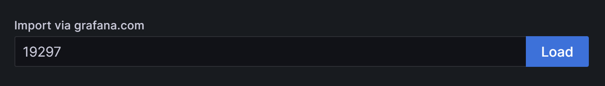
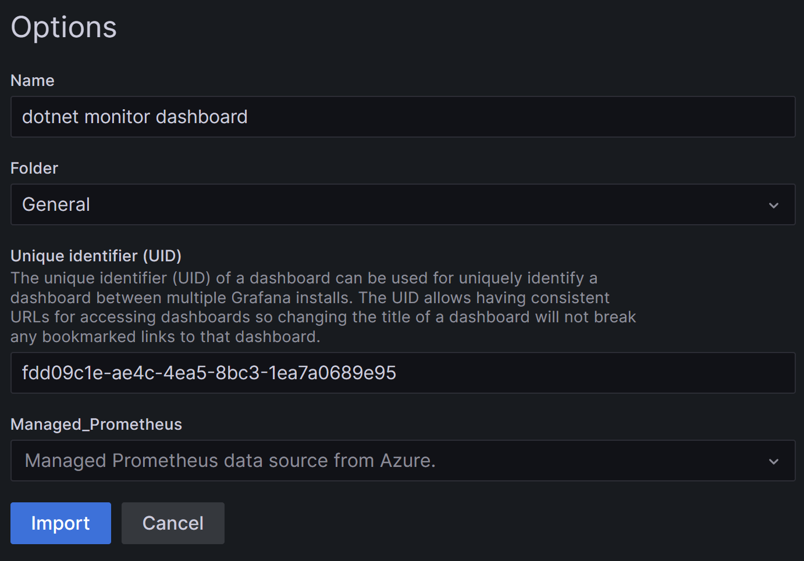

# Configure `dotnet monitor` in an AKS cluster for Managed Grafana

`dotnet monitor` provides [snapshots of .NET metrics in the Prometheus exposition format](https://github.com/dotnet/dotnet-monitor/blob/main/documentation/api/metrics.md). The [Prometheus](https://prometheus.io/docs/introduction/overview/) agent in turn collects metrics from targets by scraping metrics HTTP endpoints.

This doc provides instructions on customizing metrics scraping for a Kubernetes cluster with the metrics addon in Azure Monitor and how to subsequently renders those metrics with Grafana.

### Step 1: `dotnet monitor` configuration

The following settings ensure that the [metrics endpoint is bound to an external address](https://github.com/dotnet/dotnet-monitor/blob/main/documentation/configuration/metrics-configuration.md#metrics-urls), and not the internal localhost. Today we also recommend [setting a fairly low scraping interval for the metric count](https://github.com/dotnet/dotnet-monitor/issues/4469) as follows.

```yaml
Metrics__Endpoints: http://+:52325
Metrics__MetricCount: '1'
```

### Step 2: Include deployment annotations
You will need to update cluster deployment to scrape certain pods and specify the port, path, and scheme through annotations for the pod.

```yaml
annotations:
    prometheus.io/scrape: 'true'
    prometheus.io/path: '/metrics'
    prometheus.io/port: '52325'
    prometheus.io/scheme: 'http'
```

### Step 3: Apply ConfigMap

You can download this [metrics settings config map file](https://github.com/Azure/prometheus-collector/blob/main/otelcollector/configmaps/ama-metrics-settings-configmap.yaml) and change the settings as appropriate. The `podannotationnamespaceregex` setting requires an update to ensure that it matches the namespace configured for your app (check your deployment). If your deployment did not specify a namespace use 'default' as follows.

```yaml
podannotationnamespaceregex = "default"
```

Save your ConfigMap and apply/deploy to the kube-system namespace for your cluster as follows (only required once).

```shell
kubectl apply -f .\ama-metrics-settings-configmap.yaml -n kube-system
```

This configures the Prometheus agent to check the default namespace for active pods and uses the annotations in the pod (step 2) to scrape for Prometheus data, the scraping will occur on an interval defined in the ConfigMap. Please note it may take a few minutes for changes to take effect.

### Step 4: Configuring Azure Managed Grafana Dashboard

After creating your [Azure Managed Grafana instance](https://learn.microsoft.com/en-us/azure/managed-grafana/quickstart-managed-grafana-portal) you can start designing dashboards based on the .NET metrics exposed via Prometheus.

Navigate to the `Dashboards` page and select `New->Import`, this navigates to the import page where you can load a pre-configured dashboard. [Dotnet Monitor dashboard (19297)](https://grafana.com/grafana/dashboards/19297-dotnet-monitor-dashboard/) includes a quick start dashboard with the default metrics shared through the Prometheus agent.



Select a `Folder` for your newly imported dashboard along with the `Managed Prometheus data source` configured earlier.




### Additional links
- [Troubleshoot collection of Prometheus metrics in Azure Monitor](https://learn.microsoft.com/azure/azure-monitor/essentials/prometheus-metrics-troubleshoot)
- [Customize scraping of Prometheus metrics in Azure Monitor managed service for Prometheus](https://learn.microsoft.com/en-us/azure/azure-monitor/essentials/prometheus-metrics-scrape-configuration#configmaps)
- [Azure Managed Grafana instance](https://learn.microsoft.com/en-us/azure/managed-grafana/quickstart-managed-grafana-portal)
